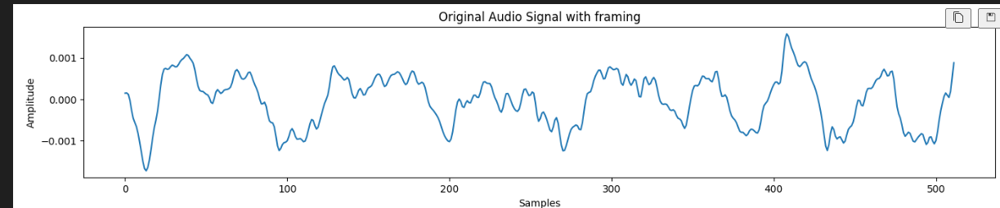
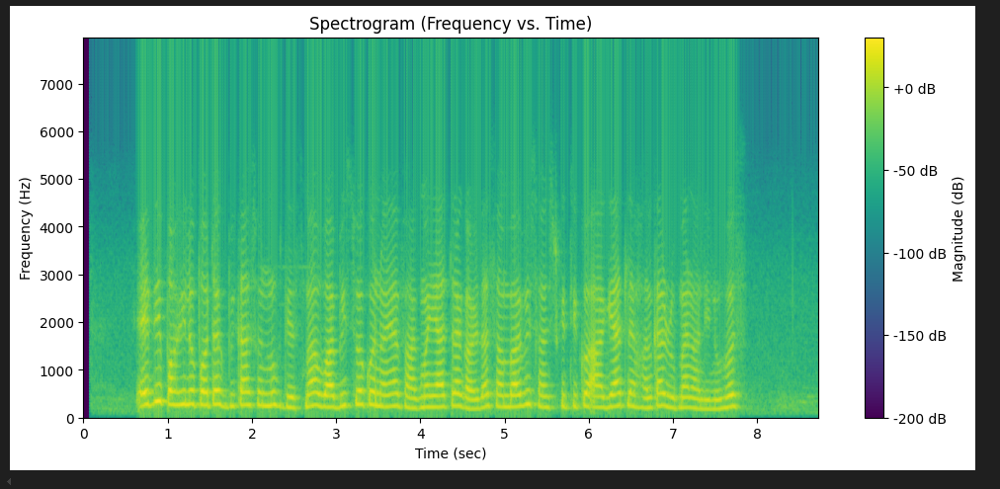

# Gender Classification using DSAP (Digital Signal Analysis & Processing)

This project is developed for the subject **DSAP (Digital Signal Analysis and Processing)** in the 7th semester of Computer Engineering curriculum at IOE, Tribhuvan University.

The main aim is to implement DSAP techniques practically using **Python** and popular libraries like `scipy`, `librosa`, and `sklearn`, and apply them in a **real-world use case**: identifying speaker gender from **spoken Nepali audio** using traditional signal processing techniques and machine learning algorithms.

---

## Project Objective

* To gain hands-on experience with DSAP techniques.
* To understand audio signal processing pipelines.
* To extract meaningful features from audio signals.
* To classify gender (male/female) using machine learning models.

---

## Dataset

* A subset of the **Google FLEURS dataset** for the Nepali language.
* Contains a total of **3,058 audio clips** (approximately equal male and female).
* Each sample is labeled with speaker gender in a CSV file: `metadata.csv`.

---

## Project Structure


├──Notebooks    ==>> Main processing and development

  ├── [eda.ipynb](./notebooks/EDA.ipynb)                ==>> Exploratory data analysis and signal processing
 
  ├── [feature_creation.ipynb](./notebooks/feature%20creation.ipynb)                              ==>> Feature extraction (MFCC, ZCR, etc.)
 
  ├── [model.ipynb](./notebooks/model.ipynb)                                ==>> Model training, evaluation, and predictions
                 


---

## Step-by-Step Implementation

### 1. **Audio Preprocessing (eda.py)**

* **Load audio files** using `librosa` at 16kHz sampling rate.
* Apply a **Butterworth bandpass filter** (80 Hz to 3000 Hz) to reduce noise and preserve speech clarity.

  * This filter removes mic hums and high-frequency hiss.
* Visualize frequency response using `matplotlib`.


This plot shows the frequency range preserved after applying the Butterworth filter. Only signals between 80 Hz and 3000 Hz are retained.

### 2. **Framing & Windowing**

* Audio is split into **25 ms frames** with **10 ms hop** (overlap).



This figure shows how a small segment of the signal is extracted using framing (Time vs Amplitude).

* Apply **Hamming window** to smooth edges of frames.


After windowing, the edges of each frame are softened to avoid spectral leakage.

* Compute **FFT** of frames to analyze frequency content.
* Generate a **spectrogram** (Frequency vs Time) visualization.



Spectrogram represents how frequency content varies over time. It helps visualize speech patterns clearly.

### 3. **Spectral Features**

* Extract **Spectral Centroid**: indicates the "center of mass" of the frequency spectrum.
* Helps differentiate between male and female voices (males typically have lower centroids).


The curve shows how spectral centroid varies with time for a sample speech signal.

---

##  Feature Extraction (feature\_creation.py)

For each audio sample, we compute:

* **F0 Mean & Std** using YIN pitch detection.
* **Spectral Centroid**
* **Zero Crossing Rate (ZCR)**
* **MFCCs (Mel Frequency Cepstral Coefficients)**

### Why MFCCs?

* Capture the shape of the vocal tract.
* Mimic how human ears perceive sound.
* Robust for speech-related tasks.

### How are MFCCs calculated?

1. Pre-emphasis
2. Framing
3. Windowing
4. FFT
5. Mel-filterbank
6. Logarithm
7. DCT (Discrete Cosine Transform)

---

## Model Training and Evaluation (model\_training\_and\_testing.py)

### Algorithms Used:

* Logistic Regression
* K-Nearest Neighbors (KNN)
* Decision Tree
* Random Forest
* Support Vector Machine (SVM)
* Gradient Boosting Classifier
* Multi-layer Perceptron (MLP / Neural Network)

### Evaluation:

* Used **10-fold cross-validation** with F1-Score.
* Results compared using `classification_report` and `ConfusionMatrixDisplay`.

---

##  Inference Demo

To classify a new audio sample:

```python
audio_path = "path_to_new_audio.wav"
features = feature_extraction(audio_path)
scaled = scaler.transform(features.reshape(1, -1))
prediction = mlp.predict(scaled)
```

Output will be `male` or `female`.

---

## Libraries Used

* `librosa` – for audio loading and feature extraction
* `scipy` – for signal filtering and DSP operations
* `sklearn` – for ML model training, scaling, evaluation
* `matplotlib`, `seaborn` – for visualizations

---


